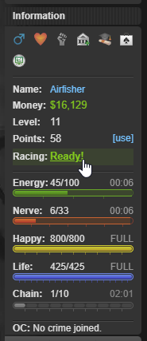
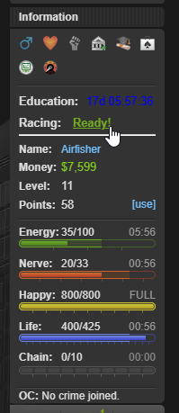

# Airfisher's Torn Script Library

## Torn Race Checker

Torn Race Checker adds a convenient race status display to your Torn sidebar that shows your current racing status at a glance.

- 📊 Displays real-time race status: "Ready!", "Waiting", or "In Race"

- 🎨 Color-coded indicators

- 👆 Click the "Ready!" status to instantly go to the racing page

- 🔄 Automatically updates as your race status changes

- ✅ Works great with the popular "Torn: Show Timers" script without any conflicts

| Default                            |      With "Torn: Show Timers"      |
| ---------------------------------- | :--------------------------------: |
|  |  |

###### ~ Thanks to `Kobacon [3474157]` for the idea

## Other Scripts

Any other script that is not listed here but are in the current repository are either currently in development or abandoned.

## Contact / Suggestions

If you have any good ideas for scripts and/or issues, please don't hesitate to either:

1. Send me a message via Torn: [`Airfisher [4074952]`](https://www.torn.com/profiles.php?XID=4074952).
2. Adding me on discord by the username: "`airfisher`".
3. Or leave an issue for the current repo [here](https://github.com/Airfisherr/torn-scripts/issues).
